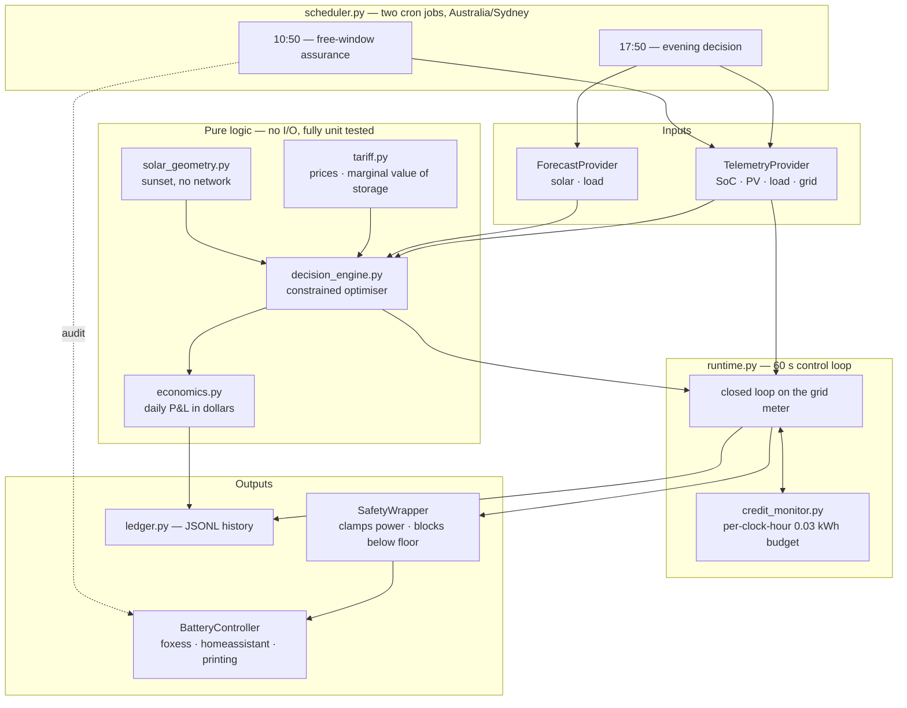

# Architecture

How `zerohero_dynamic_control` is put together, and why it is shaped this way.

For setup and day-to-day use see the [README](../README.md). This document is for
someone extending the code, porting it to another inverter or tariff, or deciding
whether to trust it with their battery.

---

## 1. The problem

A home battery on the GloBird **ZEROHERO** plan (NSW) faces three prices that make
naive control actively lose money:

| | Window | Price |
|---|---|---|
| Import | 11:00–14:00 | **$0.00/kWh** |
| Import | 16:00–23:00 | $0.528/kWh |
| Import | 14:00–16:00, 23:00–11:00 | $0.407/kWh |
| Export | 18:00–21:00, first ~15 kWh | **$0.10/kWh** (0.02 FiT + 0.08 top-up) |
| Export | 23:00–16:00 | **$0.00/kWh** |
| ZeroHero credit | grid import < 0.03 kWh in *every hour* of 18:00–21:00 | **−$1.00/day** |
| Supply charge | — | $1.584/day |

Three consequences drive every design decision below:

1. **Export is only worth anything inside 18:00–21:00.** Generating more solar does
   not help; *moving* export into that window does.
2. **A stored kWh is worth up to $0.528** — but only while it actually displaces
   import. Past that point it is worth its $0.10 export value and nothing more.
3. **The credit rule is per clock hour.** 0.03 kWh is 1.8 kW for one minute. A single
   appliance start at 18:05 burns the 18:00 hour outright, and no amount of good
   behaviour later can win it back.

So the objective is **net daily dollars**, not maximum SOC and not maximum export:
hold import at zero through the window, then sell exactly the energy that tomorrow's
free charging would otherwise strand.

---

## 2. Shape of the system



### Why the split

**The brain does no I/O.** `decision_engine`, `tariff`, `economics` and
`solar_geometry` are pure functions over plain data. That is what makes the
economics testable against a real invoice, and the physics testable against a
hundred parameter combinations, in under half a second.

**The loop does no optimisation.** `runtime.py` takes a plan and a meter reading and
produces a setpoint. It has no opinion about tariffs.

**The edges are swappable.** Providers and controllers are abstract; the core never
learns what hardware it is talking to.

---

## 3. The physics the optimiser respects

One power balance holds at every instant (battery positive = discharging):

```
solar + battery = load + export          (1)
grid = load − solar − battery            (2)      grid > 0 is import
```

**Holding the credit** means `grid ≤ 0`, so the battery must cover the net load:

```
battery ≥ load − solar                   (3)
```

**A hybrid inverter's AC limit applies to PV and battery together**, because they
share one AC port:

```
solar + battery ≤ 10 kW                  (4)
⇔  load + export ≤ 10 kW                 (5)
```

Equation (5) is the one that catches naive controllers. **Solar does not give you
export headroom on a hybrid — it competes for the same 10 kW.** At 18:00 in January
with 4 kW of PV still coming in, the battery can contribute at most 6 kW no matter
how full it is. What solar buys you is battery *energy*: every kW of PV is a kW the
battery does not have to supply.

Adding the network export limit gives the admissible band per slot:

```
max(0, net_load + margin) ≤ battery ≤ B_max

B_max = min( battery_max_discharge,
             ac_limit − solar,                  [hybrid only]
             grid_export_limit + load − solar )  (6)
```

And energy, where conversion losses bite:

```
dc_drawn = ac_delivered / discharge_efficiency            (7)
dc_drawn ≤ (soc − reserve)/100 × usable_capacity_kwh      (8)
```

If PV sits on its own AC-coupled inverter, set `inverter.solar_shares_ac_limit:
false` and (4) drops out.

---

## 4. How a decision is made

`DecisionEngine.plan()` is one pass, no iteration:

1. **Slice** the remaining window into 5-minute slots.
2. **Per slot**, take forecast solar and load, compute the mandatory discharge from
   (3) plus a deliberate safety margin, and the export headroom from (6).
3. **Integrate** to get the mandatory kWh — the energy that buys the $1.
4. **Value the surplus.** `marginal_value_of_stored_energy()` asks how full the pack
   will be at 11:00 tomorrow and how much of the free charging window it can still
   absorb. Energy occupying space that free charging would refill anyway is
   *stranded*, and stranded energy is worth exactly its export price. Everything
   else displaces import at $0.407–$0.528 and is kept.
5. **Cap** at the Super Export limit — beyond it the rate drops to $0.02, well under
   what the energy is worth in the battery.
6. **Allocate** the export budget across slots by water-filling, respecting each
   slot's power headroom. Shape is configurable; the default front-loads so revenue
   is banked before anything can go wrong.
7. **Clip** to the energy floor, and report the shortfall.
8. **Price** the result as a daily P&L.

### When the window cannot be won

If the pack cannot cover all three hours, the credit is lost regardless — the rule
needs *every* hour. Spending the remaining charge chasing it just means importing at
$0.528 afterwards. So the engine abandons the credit, reverts to self-consumption,
and discharges only as deep as the price comparison justifies (evening peak $0.528
vs overnight blend $0.424, so tonight wins).

---

## 5. The control loop

The 17:50 plan is a forecast. Reality diverges, so the loop closes on the **grid
meter** — the number the retailer actually bills:

```
error    = grid_kw − (−planned_export_kw)
setpoint = current_battery_kw + error          # gain of exactly 1
```

The gain of 1 is not a tuning parameter. Adding 1 kW of discharge removes exactly
1 kW of import, so the loop is deadbeat in one step with nothing to tune.

Three protections sit on top:

- a standing export margin, so the meter shows a small export rather than hovering
  at exactly zero where noise could tip a sample into import;
- **escalation** of that margin as the current hour's 0.03 kWh allowance is consumed;
- an **energy guard** that drops opportunistic export the moment the remaining charge
  stops comfortably covering the rest of the window.

`CreditMonitor` integrates import trapezoidally into per-clock-hour buckets. With a
60 s poll and a 0.03 kWh budget, treating a ramp as a step can misestimate an hour by
a third of the entire allowance.

---

## 6. Safety: four independent layers

No single failure can strand the battery in a forced mode.

| Layer | Mechanism | Survives |
|---|---|---|
| 1. Planner | Never plans below the reserve; `_enforce_energy_floor` clips the profile | A bad forecast |
| 2. `SafetyWrapper` | Clamps every command to the AC limit, blocks discharge below the floor | A planner bug, a bad manual override |
| 3. **Bounded schedule group** | Every group written carries an explicit end *inside* the window, so the inverter releases the battery itself at 20:59 | Container killed, NAS crash, network loss, API quota exhausted |
| 4. **`fdSoc` deadman** | Hardware stop-SOC set to the *planning* reserve, not the emergency floor | The process dying mid-window while discharging |

Layer 3 is the important one: **the safety model does not depend on this program
staying alive.** `_assert_bounded()` refuses to write an unbounded forced group, and
a test asserts it on every write.

Graceful shutdown (SIGTERM → close out → restore schedule) is a *nicety* on top, not
the guarantee.

### Coexisting with the owner's schedule

`scheduler/enable` replaces the entire group list — there is no per-group patch. A
naive write would wipe the user's own 11:00–14:00 ForceCharge group, costing a whole
day of free energy. So the controller **merges**: it replaces an overlapping group in
place if there is one, otherwise inserts ahead of the all-day catch-all, and never
deletes anything.

---

## 7. Failure modes

| Failure | Behaviour |
|---|---|
| One telemetry poll fails | `CachingTelemetryProvider` serves the last good reading, marked stale |
| Telemetry stale > 10 min | Blind fallback: force export at a fixed kW until 21:00 |
| Solar forecast fails | Assume **zero** residual solar — over-reserves battery, which cannot cost the credit |
| Load forecast fails | Static evening average |
| Vendor API quota exhausted | `CallBudget` refuses routine calls, reserves enough for close-out |
| Controller write fails | Logged; loop retries next tick; the bounded group still expires |
| Not enough charge for the window | Abandon the credit, revert to self-consumption (see §4) |
| Anything asks for > AC limit or below the floor | `SafetyWrapper` clamps and records the violation |

The bias throughout: **fail towards keeping the battery charged.** An over-reserved
battery costs fractions of a kWh; an under-reserved one costs the whole $1 plus
peak-rate import.

---

## 8. Extension points

### A different inverter

Implement `BatteryController` — three methods:

```python
async def set_mode(mode, *, now, reason)      # self_consumption | force_export | force_charge
async def set_power(power_kw, *, now, reason) # >0 discharge, <0 charge
def capabilities() -> ControllerCapabilities
```

`capabilities()` is what makes limited hardware degrade gracefully rather than fail.
A Powerwall has no continuous power setpoint — only operation mode, backup reserve
and a TOU tariff — so it reports `supports_power_setpoint=False,
supports_soc_target=True` and the loop switches from fine power modulation to
coarse SOC-target control by itself.

Register it in `controllers/__init__.py::build_controller`.

### A different tariff

`tariff.py` is a data model, not hard-coded rates. Edit the `import_periods` and
`export_periods` lists in `config.yaml`. Windows may wrap midnight.

If your plan has no ZeroHero-style credit, set `zerohero_credit_aud: 0` and the
engine reduces to plain arbitrage — it will still refuse to sell energy worth more
kept than sold.

### A different data source

Implement `TelemetryProvider.read()` returning a `Telemetry`. Normalise signs at the
edge: `battery_kw > 0` discharging, `grid_kw > 0` importing. Nothing downstream
should know that your vendor reports import and export as two separate non-negative
variables.

---

## 9. Testing

153 tests, all offline — no network, no credentials, no hardware.

| Kind | What it pins |
|---|---|
| **Economics** | The tariff model reproduces a real invoice **to the cent**. If this fails, every dollar figure is wrong |
| **Physics** | Equations (4) and (5) hold in every planned slot, parametrised over load |
| **Energy floor** | Parametrised over SOC 12%→100%, the plan never crosses the floor |
| **Integration** | The same invariants checked against the *simulated hardware*, sample by sample |
| **Adversarial** | Forecast says sunny and quiet, reality is the opposite — the meter closed-loop has to save it |
| **Rule semantics** | A breach in one hour cannot be made up in another; 1.5 kW for 2 min = 0.05 kWh loses the day |
| **Vendor quirks** | Signature uses literal `\r\n` characters; `fdPwr` is watts not kilowatts; written groups always self-terminate |

The simulation harness runs the **real** engine, loop, credit monitor and safety
wrapper against a physical site model — shared AC port, conversion losses, finite
ramp rate, BMS floor. It is not a mock of the control logic.

---

## 10. Module map

| Module | Responsibility |
|---|---|
| `decision_engine.py` | The optimiser. Pure. Contains the physics derivation |
| `tariff.py` | Prices by time of day; marginal value of stored energy |
| `economics.py` | Daily P&L in dollars |
| `credit_monitor.py` | Per-clock-hour import budget |
| `runtime.py` | Control loop; free-charge runner |
| `free_window.py` | 11:00–14:00 config audit + behaviour assurance |
| `scheduler.py` | Cron jobs, signal handling, graceful shutdown |
| `solar_geometry.py` | NOAA sunrise/sunset, no network dependency |
| `curves.py` | Forecast interpolation |
| `clock.py` | `RealClock` / `SimClock` — same loop in production and simulation |
| `ledger.py` | JSONL decisions, samples, daily outcomes |
| `foxess_client.py` | Signed FoxESS transport, rate limits, daily call budget |
| `data_providers/` | `base` · `static_forecast` · `open_meteo` · `foxess` · `simulated` |
| `controllers/` | `base` (+`SafetyWrapper`) · `printing` · `foxess` · `homeassistant` · `tesla_fleet` · `simulated` |
| `simulation/` | Scenario profiles and the harness |

---

## 11. Known limits

- Built and tested against **one** site: a FoxESS H3-10.0-Smart with a 47 kWh pack
  in NSW on ZEROHERO. Other plans and inverters are supported by design, not
  by evidence.
- Local Modbus telemetry (`data_providers/foxess_modbus.py`) replaces the cloud's
  ~5-minute snapshot with seconds-old readings, behind a failover to the cloud.
  It is verified against a fake server only until `zerohero modbus-probe` passes on
  the real inverter. Writes still go through the cloud scheduler.
- `solcast` is unimplemented.
- `tesla_fleet` is a documented skeleton that raises clearly rather than pretending.
- The Super Export cap of 15 kWh is an assumption. The bill line reads "Step 1",
  implying further steps at other rates, and the reference site never approached the
  cap so it was never observed directly.
- `overnight_load_kw` and `morning_solar_to_battery_kwh` are the two inputs that
  decide how much gets sold, and both are site-specific. Run in shadow mode
  (`controller.type: printing`) for a week and tune them from the ledger.
